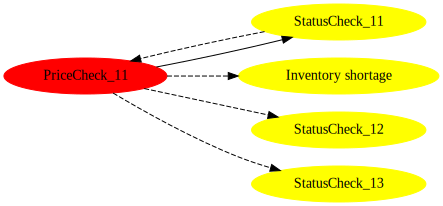
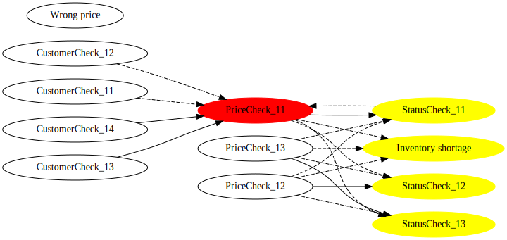
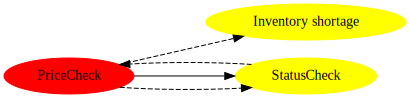

# drools-impact-analysis

This tool can:

* Analyze relationships between rules
* Analyze impacts of changing a rule
* Visualize the graph using Dot language format. Simple text format is also available.

This is an *experimental* feature. The APIs may change in future versions.

## Usage

You can find an example usage in ExampleUsageTest.java

1) Have `drools-impact-analysis-graph-graphviz` in your project dependency

```xml
    <dependency>
      <groupId>org.drools</groupId>
      <artifactId>drools-impact-analysis-graph-graphviz</artifactId>
      <version>${drools.version}</version>
    </dependency>
```

2) Create a `KieFileSystem` to store your assets as usual. Then call `KieBuilder.buildAll(ImpactAnalysisProject.class)`. You can get `AnalysisModel`.

```java
        // set up KieFileSystem
        ...
        KieBuilder kieBuilder = KieServices.Factory.get().newKieBuilder(kfs).buildAll(ImpactAnalysisProject.class);
        ImpactAnalysisKieModule analysisKieModule = (ImpactAnalysisKieModule) kieBuilder.getKieModule();
        AnalysisModel analysisModel = analysisKieModule.getAnalysisModel();
```
3) Convert the `AnalysisModel` to `Graph` using `ModelToGraphConverter`

```java
        ModelToGraphConverter converter = new ModelToGraphConverter();
        Graph graph = converter.toGraph(analysisModel);
```

4) Specify a rule which you plan to change. `ImpactAnalysisHelper` will produce a sub graph which contains the changed rule and impacted rules

```java
        ImpactAnalysisHelper impactFilter = new ImpactAnalysisHelper();
        Graph impactedSubGraph = impactFilter.filterImpactedNodes(graph, "org.drools.impact.analysis.example.PriceCheck_11");
```

5) Generate a graph image using `GraphImageGenerator`. You can choose the format from DOT, SVG and PNG.

```java
        GraphImageGenerator generator = new GraphImageGenerator("example-impacted-sub-graph");
        generator.generateSvg(impactedSubGraph);
```

* DOT : Quick. Can be visualized by other Graphviz tools
* SVG : Quicker than PNG
* PNG : Slow. Probably not useful for a large number of rules

6) Simple text output is also available using `TextReporter`. You can choose the format from HierarchyText and FlatText.

```java
        String hierarchyText = TextReporter.toHierarchyText(impactedSubGraph);
        System.out.println(hierarchyText);
```

## Tips

* Typical use case is to view an impacted sub graph. Red node is a *changed* rule. Yellow nodes are *impacted* rules. Solid arrow represents *positive* impact, where the source rule activates the target rule. Dashed arrow represents *negative* impact, where the source rule deactivates the target rule. Dotted arrow represents *unknown* impact, where the source rule may activate or deactivate the target rule.



* Whole graph could be too large if you have many rules.



* You can *collapse* the graph based on rule name prefix (= RuleSet in spreadsheet) using `GraphCollapsionHelper`. It will help you to see the overview. You can also use `ImpactAnalysisHelper` to the collapsed graph.

```java
        Graph collapsedGraph = new GraphCollapsionHelper().collapseWithRuleNamePrefix(graph);
        Graph impactedCollapsedSubGraph = impactFilter.filterImpactedNodes(collapsedGraph, "org.drools.impact.analysis.example.PriceCheck");
```



* You can filter the relations by giving `positiveOnly` to `true` for `ModelToGraphConverter`, `ImpactAnalysisHelper` and `GraphCollapsionHelper` constructor. So you can view only positive relations.

```java
        ModelToGraphConverter converter = new ModelToGraphConverter(true);
        Graph graph = converter.toGraph(analysisModel);
        ImpactAnalysisHelper impactFilter = new ImpactAnalysisHelper(true);
        Graph impactedSubGraph = impactFilter.filterImpactedNodes(graph, "org.drools.impact.analysis.example.PriceCheck_11");
```


* If the number of rules is very large, text output would be useful. `[*]` is a *changed* rule. `[+]` is *impacted* rules. A rule with parentheses means a circular reference so it doesn't render further.

```
--- toHierarchyText ---
Inventory shortage[+]
PriceCheck_11[*]
  StatusCheck_12[+]
  (Inventory shortage)
  StatusCheck_13[+]
  StatusCheck_11[+]
    (PriceCheck_11)

--- toFlatText ---
Inventory shortage[+]
PriceCheck_11[*]
StatusCheck_11[+]
StatusCheck_12[+]
StatusCheck_13[+]
```
