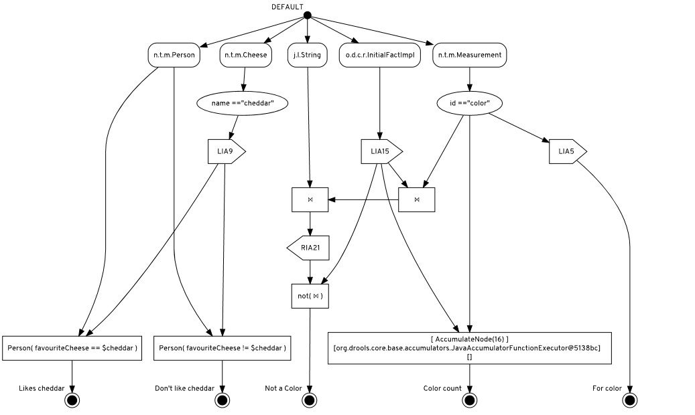
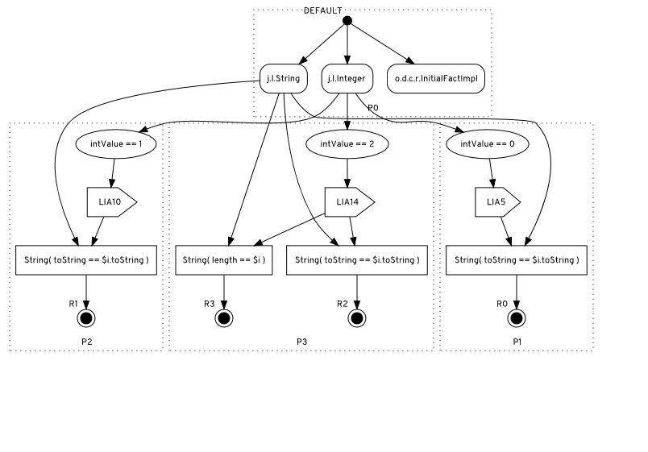

<!--
  Licensed to the Apache Software Foundation (ASF) under one
  or more contributor license agreements.  See the NOTICE file
  distributed with this work for additional information
  regarding copyright ownership.  The ASF licenses this file
  to you under the Apache License, Version 2.0 (the
  "License"); you may not use this file except in compliance
  with the License.  You may obtain a copy of the License at

    http://www.apache.org/licenses/LICENSE-2.0

  Unless required by applicable law or agreed to in writing,
  software distributed under the License is distributed on an
  "AS IS" BASIS, WITHOUT WARRANTIES OR CONDITIONS OF ANY
  KIND, either express or implied.  See the License for the
  specific language governing permissions and limitations
  under the License.
  -->

# drools-retediagram

An experiment to plot Rete diagram, similar to `ReteDumper`, using Dot language format.

## Usage

To plot the diagram files for a Knowledge Base of a given `KieSession` using the defaults:

```java
ReteDiagram.newInstance().diagramRete(kieSession);
```

It is possible to change some settings and formatting, as in the following example:

```java
ReteDiagram.newInstance()
    .configLayout(Layout.PARTITION) // use Partition layout, instead of default Vertical layout
    .configFilenameScheme(new File("./target"), true) // set output directory manually instead of OS default for temporary directory
    .configOpenFile(true, false) // automatically open SVG file with OS default application
    .diagramRete(kieSession);
```

Please notice to leverage the OS capability to automatically open file with the default application, it is required that the JVM property `java.awt.headless` but be `false`, which can be set manually with:

```java
System.setProperty("java.awt.headless", "false");
```

## Example: simple KB plotted with default Vertical layout

Given the following rules in the Knowledge Base:

```
rule "For color"
no-loop
when
  Measurement( id == "color", $colorVal : val )
then
  controlSet.add($colorVal);
end

rule "Likes cheddar"
when
  Cheese( $cheddar : name == "cheddar" )
  $person : Person( favouriteCheese == $cheddar )
then
  System.out.println( $person.getName() + " likes cheddar" );
end

rule "Don't like cheddar"
when
  Cheese( $cheddar : name == "cheddar" )
  $person : Person( favouriteCheese != $cheddar )
then
  System.out.println( $person.getName() + " does not like cheddar" );
end

rule "Color count"
when
  accumulate( $m: Measurement( id == "color" ); $c: count($m) )
then
  System.out.println( $c );
end

rule "Not a Color"
when
  not ( Measurement( id == "color" ) and String() )
then
  System.out.println( "no color yet." );
end
```

The diagram plotted with the defaults settings and Vertical layout:

```java
ReteDiagram.newInstance().diagramRete(kieSession);
```

is rendered as:



the diagram displays the default entry point, Object Type nodes, Alpha nodes, Left Input Adapter nodes, join Beta nodes, etc. down to Rule Terminal nodes.

## Example: plotting Partition layout

Given the following rules in the Knowledge Base:

```
rule R0 when
  $i : Integer( intValue == 0 )
  String( toString == $i.toString )
then
  list.add($i);
end
rule R1 when
  $i : Integer( intValue == 1 )
  String( toString == $i.toString )
then
  list.add($i);
end
rule R2 when
  $i : Integer( intValue == 2 )
  String( toString == $i.toString )
then
  list.add($i);
end
rule R3 when
  $i : Integer( intValue == 2 )
  String( length == $i )
then
  list.add($i);
end
```

The diagram plotted with the Partition layout:

```java
ReteDiagram.newInstance().configLayout(Layout.PARTITION).diagramRete(ksession);
```

is rendered as:



The diagram displays nodes in their respective Partitions.
