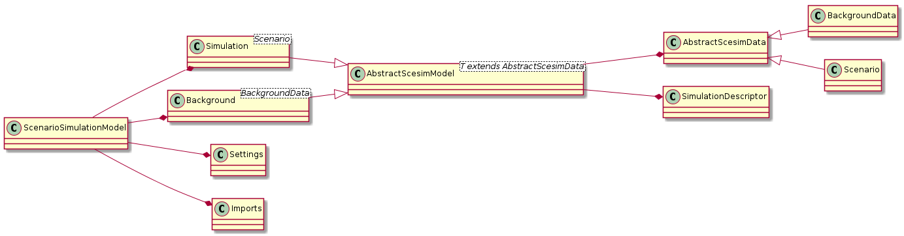

<!--
  Licensed to the Apache Software Foundation (ASF) under one
  or more contributor license agreements.  See the NOTICE file
  distributed with this work for additional information
  regarding copyright ownership.  The ASF licenses this file
  to you under the Apache License, Version 2.0 (the
  "License"); you may not use this file except in compliance
  with the License.  You may obtain a copy of the License at

    http://www.apache.org/licenses/LICENSE-2.0

  Unless required by applicable law or agreed to in writing,
  software distributed under the License is distributed on an
  "AS IS" BASIS, WITHOUT WARRANTIES OR CONDITIONS OF ANY
  KIND, either express or implied.  See the License for the
  specific language governing permissions and limitations
  under the License.
  -->

Scenario Simulation Model
=========================

**ScenarioSimulationModel** is the class representing the _data-model_ used inside ScenarioSimulation editor.

It consists of four parts:

1. **Simulation**
2. **Background**
3. **Settings**
4. **Imports**

Simulation
----------
This object contains the structure (as **SimulationDesciptor**) and the data (list of **Scenario**) 
to actually run simulations

Background
----------
This object contains the structure (as **SimulationDesciptor**) and the data (list of **BackgroundData**) 
to use for create multiple objects to be used inside **Simulation**

Settings
--------
This object contains the _ScenarioSimulation-specific_ configurations needed 
to actually run simulations

Imports
-------
Data object models imported.

Class diagram
-------------

[PUML diagram](scenariosimulationmodel.puml)

