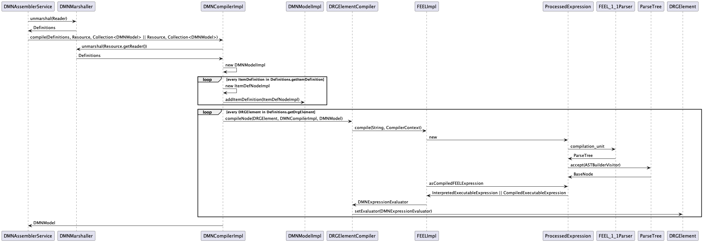
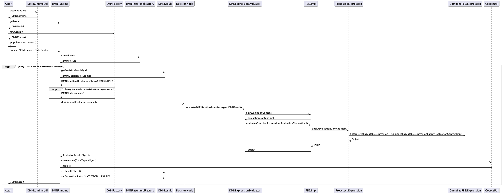

# kie-dmn - Developer Guide

This module (and all its submodules) contains the code that make up the DMN engine.

The engine is responsible, in very general terms, of
1. compile the dmn model
2. validate it
3. evaluate it, against a given input; please note that execution could be statically-interpreted or dynamically-code-generated (see later on [Interpreted vs Codegen](#interpreted-vs-codegen))

## Structure
### DTOs
#### * [Definitions](kie-dmn-model%2Fsrc%2Fmain%2Fjava%2Forg%2Fkie%2Fdmn%2Fmodel%2Fapi%2FDefinitions.java): the direct representation of the original XML
#### * [DMNResource](kie-dmn-core%2Fsrc%2Fmain%2Fjava%2Forg%2Fkie%2Fdmn%2Fcore%2Fassembler%2FDMNResource.java): a wrapper used to forward `Definitions` with additional informations (e.g. [ResourceWithConfiguration](..%2Fkie-api%2Fsrc%2Fmain%2Fjava%2Forg%2Fkie%2Fapi%2Fio%2FResourceWithConfiguration.java))
#### * [DMNNode](kie-dmn-api%2Fsrc%2Fmain%2Fjava%2Forg%2Fkie%2Fdmn%2Fapi%2Fcore%2Fast%2FDMNNode.java): the _ast_ representation of high-level nodes inside the model; it map to **_BusinessKnowledge_**, **_Decision_**, **_DecisionService_**, **_ItemDef_**, or **_InputData_**
#### * [BaseNode](kie-dmn-feel%2Fsrc%2Fmain%2Fjava%2Forg%2Fkie%2Fdmn%2Ffeel%2Flang%2Fast%2FBaseNode.java): the _ast_ representation of low-level nodes inside the model (e.g. **_Boolean_**, **_AtLiteral_**, **_UnaryTest_**, **_String_**, ecc.)
#### * [CompiledFEELExpression](kie-dmn-feel%2Fsrc%2Fmain%2Fjava%2Forg%2Fkie%2Fdmn%2Ffeel%2Fcodegen%2Ffeel11%2FCompiledFEELExpression.java): the object that represents and actually executes a specific _FEEL-expression_; it is also a `FunctionalInterface`, since it extends `Function<EvaluationContext, Object>`
#### * [InterpretedExecutableExpression](kie-dmn-feel%2Fsrc%2Fmain%2Fjava%2Forg%2Fkie%2Fdmn%2Ffeel%2Flang%2Fimpl%2FInterpretedExecutableExpression.java): the `CompiledFEELExpression` instantiated for statically-interpreted execution of the specific _FEEL-expression_
#### * [CompiledExecutableExpression](kie-dmn-feel%2Fsrc%2Fmain%2Fjava%2Forg%2Fkie%2Fdmn%2Ffeel%2Flang%2Fimpl%2FCompiledExecutableExpression.java): the `CompiledFEELExpression` instantiated for code-generated execution of the specific _FEEL-expression_
#### * [ProcessedExpression](kie-dmn-feel%2Fsrc%2Fmain%2Fjava%2Forg%2Fkie%2Fdmn%2Ffeel%2Fcodegen%2Ffeel11%2FProcessedExpression.java): the result of the compilation of a specific _FEEL-expression_; in turns, it wraps the actual `CompiledFEELExpression` to be executed; please note that a _FEEL-expression_ could represent an aggregation of other sub-expressions; so, in turns, a `ProcessedExpression` may contain nested ones
#### * [DMNExpressionEvaluator](kie-dmn-core%2Fsrc%2Fmain%2Fjava%2Forg%2Fkie%2Fdmn%2Fcore%2Fapi%2FDMNExpressionEvaluator.java): a `FunctionalInterface` that it is invoked by evaluation objects (e.g. `Decision`) to actually invoke the generated `ProcessedExpression`;
#### * [DMNModel](kie-dmn-api%2Fsrc%2Fmain%2Fjava%2Forg%2Fkie%2Fdmn%2Fapi%2Fcore%2FDMNModel.java): the high-level result of the compilation, to be used to invoke the overall evaluation; it contains `Definitions` and all the `DMNNode`s obtained by compilation
#### * [DMNResult](kie-dmn-api%2Fsrc%2Fmain%2Fjava%2Forg%2Fkie%2Fdmn%2Fapi%2Fcore%2FDMNResult.java): an instance that encapsulates all the information resulting from a DMN service invocation;
#### * [DMNDecisionResult](kie-dmn-api%2Fsrc%2Fmain%2Fjava%2Forg%2Fkie%2Fdmn%2Fapi%2Fcore%2FDMNDecisionResult.java): an instance that stores the result of the evaluation of a decision

### Code usage

#### Compilation
The simplest way to compile a model is to instantiate a [DMNRuntime](kie-dmn-api%2Fsrc%2Fmain%2Fjava%2Forg%2Fkie%2Fdmn%2Fapi%2Fcore%2FDMNRuntime.java) from its file, e.g.
 ```java
      DMNRuntime runtime = DMNRuntimeUtil.createRuntime("simple-item-def.dmn", this.getClass() );
 ``` 
[DMNRuntimeUtil](kie-dmn-core%2Fsrc%2Ftest%2Fjava%2Forg%2Fkie%2Fdmn%2Fcore%2Futil%2FDMNRuntimeUtil.java) has different overrides of the `createRuntime` method

#### Validation
To validate a dmn model, it is necessary to:
1. get an instance of [DMNValidator](kie-dmn-validation%2Fsrc%2Fmain%2Fjava%2Forg%2Fkie%2Fdmn%2Fvalidation%2FDMNValidator.java), built with some [DMNProfile](kie-dmn-core%2Fsrc%2Fmain%2Fjava%2Forg%2Fkie%2Fdmn%2Fcore%2Fcompiler%2FDMNProfile.java); e.g.
    ```java
      List<DMNProfile> defaultDMNProfiles = DMNAssemblerService.getDefaultDMNProfiles(ChainedProperties.getChainedProperties(ClassLoaderUtil.findDefaultClassLoader()));
      DMNValidator validator = DMNValidatorFactory.newValidator(defaultDMNProfiles);
   ``` 
2. invoke one of the `DMNValidator` methods; e.g.
   ```java
      List<DMNMessage> validate = validator.validate(
                getFile("dmn14simple.dmn"),
                VALIDATE_SCHEMA, VALIDATE_MODEL, VALIDATE_COMPILATION);
   ```

### Execution
To execute a dmn model, it is necessary to:
1. get an instance of `DMNRuntime`, built around the given model; e.g.
    ```java
      DMNRuntime runtime = DMNRuntimeUtil.createRuntime("simple-item-def.dmn", this.getClass() );
   ``` 
2. get the instance of `DMNModel` out of the former; e.g.
    ```java
      DMNModel dmnModel = runtime.getModel("https://github.com/kiegroup/kie-dmn/itemdef", "simple-item-def" );
   ```
3. instantiate a [DMNContext](kie-dmn-api%2Fsrc%2Fmain%2Fjava%2Forg%2Fkie%2Fdmn%2Fapi%2Fcore%2FDMNContext.java) with the required input; e.g.
    ```java
      DMNContext context = DMNFactory.newContext();
      context.set( "Monthly Salary", 1000 );
   ```
4. get the `DMNResult`
   ```java
      DMNResult dmnResult = runtime.evaluateAll(dmnModel, context );
   ```
5. depending on the model, the actual result could be stored in the given context, or inside a `DMNDecisionResult`

Please note that `DMNRuntime` has different `evaluate*` methods

### Execution flows

#### Compilation

The original xml is first parsed to `Definitions` by the [DMNMarshaller](kie-dmn-api%2Fsrc%2Fmain%2Fjava%2Forg%2Fkie%2Fdmn%2Fapi%2Fmarshalling%2FDMNMarshaller.java), that is a simple xml-marshaller([DMNAssemblerService#addResourcesAfterRules](kie-dmn-core%2Fsrc%2Fmain%2Fjava%2Forg%2Fkie%2Fdmn%2Fcore%2Fassembler%2FDMNAssemblerService.java)).

Then, each `Definitions` is wrapped inside a `DMNResource` and _compiled_ by [DMNCompilerImpl](kie-dmn-core%2Fsrc%2Fmain%2Fjava%2Forg%2Fkie%2Fdmn%2Fcore%2Fcompiler%2FDMNCompilerImpl.java).

Each element of the `Definitions` is further translated to `DMNNode`.

Then, the text representing each `DMNNode` is compiled by the [DecisionCompiler](kie-dmn-core%2Fsrc%2Fmain%2Fjava%2Forg%2Fkie%2Fdmn%2Fcore%2Fcompiler%2FDecisionCompiler.java) and, in turn, by [FEELImpl](kie-dmn-feel%2Fsrc%2Fmain%2Fjava%2Forg%2Fkie%2Fdmn%2Ffeel%2Flang%2Fimpl%2FFEELImpl.java), that would return a `ProcessedExpression`. 

Inside `ProcessedExpression`, the expression is parsed to `org.antlr.v4.runtime.tree.ParseTree` by `org.kie.dmn.feel.parser.feel11.FEEL_1_1Parser` (auto-generated), and that `ParsedTree` is visited by [ASTBuilderVisitor](kie-dmn-feel%2Fsrc%2Fmain%2Fjava%2Forg%2Fkie%2Fdmn%2Ffeel%2Fparser%2Ffeel11%2FASTBuilderVisitor.java) to get the `BaseNode` **_ast_**, that recursively contains all the nested `BaseNode`s.

Finally, the `CompiledFEELExpression` to be executed is returned (`ProcessedExpression#asCompiledFEELExpression`).



##### Interpreted vs Codegen
The retrieved `CompiledFEELExpression` could be a _statically-interpreted_ `InterpretedExecutableExpression` (that wraps the original `BaseNode` **_ast_**) or could be a _dynamically-code-generated_ `CompiledExecutableExpression`, in which case:
1. source code is generated out of the given  `BaseNode` **_ast_** (by `ASTCompilerVisitor`)
2. code is compiled in-memory to a `CompiledExecutableExpression (by [CompilerBytecodeLoader](kie-dmn-feel%2Fsrc%2Fmain%2Fjava%2Forg%2Fkie%2Fdmn%2Ffeel%2Fcodegen%2Ffeel11%2FCompilerBytecodeLoader.java))
3. the above `CompiledFEELExpression` is wrapped and returned inside a `CompiledExecutableExpression`

#### Validation
Depending on a series of flags ( `VALIDATE_SCHEMA`, `VALIDATE_MODEL`, `VALIDATE_COMPILATION`, `ANALYZE_DECISION_TABLE`), [DMNValidatorImpl](kie-dmn-validation%2Fsrc%2Fmain%2Fjava%2Forg%2Fkie%2Fdmn%2Fvalidation%2FDMNValidatorImpl.java) executes the validation of the given model. 

Behind the scenes, the validation also uses the _rule engine_ and the _rules_ defined in the different `kie-dmn/kie-dmn-validation/src/main/resources/org/kie/dmn/validation/DMNv1()/*.drl` files.
This validation is fired inside `private List<DMNMessage> validateModel(DMNResource mainModel, List<DMNResource> otherModels)`

#### Execution

When `DMNRuntime#evaluate*` is invoked, a `DMNResult` is instantiated, containing a map with `DMNDecisionResult`s, initially marked as `NOT_EVALUATED`.

Then, for each [DecisionNode](kie-dmn-api%2Fsrc%2Fmain%2Fjava%2Forg%2Fkie%2Fdmn%2Fapi%2Fcore%2Fast%2FDecisionNode.java): 
1. the mapped `DMNDecisionResult` is marked as `EVALUATING`
2. the associated [DMNExpressionEvaluator](kie-dmn-core%2Fsrc%2Fmain%2Fjava%2Forg%2Fkie%2Fdmn%2Fcore%2Fapi%2FDMNExpressionEvaluator.java) is retrieved (`DecisionNodeImpl#getEvaluator()`)
3. the `DMNExpressionEvaluator#evaluate(DMNRuntimeEventManager, DMNResult)` method is invoked (see [DMNExpressionEvaluator](#--dmnexpressionevaluatorjava-a-functionalinterface-that-it-is-invoked-by-evaluation-objects-eg-decision-to-actually-invoke-the-generated-processedexpression))
4. inside the concrete implementation, a new `EvaluationContextImpl` is created from the `FEELImpl` instance
5. the `FEELimpl#evaluate(CompiledExpression expr, EvaluationContext ctx)` method is invoked, passing the `CompiledExpression` _**expression**_ wrapped by the current `DMNExpressionEvaluator`
6. in turns, the `ProcessedExpression#apply(EvaluationContext)` method is invoked (`ProcessedExpression` is the actual type of `CompiledExpression`)
7. this result in invocation of the wrapped `CompiledFEELExpression` **_executableFEELExpression_** (that could be an `InterpretedExecutableExpression` or a `CompiledExecutableExpression`)
8. this, recursively, iterate over all the nested expressions, invoking the [FEELFunction](kie-dmn-feel%2Fsrc%2Fmain%2Fjava%2Forg%2Fkie%2Fdmn%2Ffeel%2Fruntime%2FFEELFunction.java)s mapped to any expression, until a given final result is provided, as `Object`
9. then, the returned object is coerced to the type requested by the decision, the result is stored in the mapped `DMNDecisionResult`, and that latter is marked as `SUCCEEDED`



### [BaseFEELFunction](kie-dmn-feel%2Fsrc%2Fmain%2Fjava%2Forg%2Fkie%2Fdmn%2Ffeel%2Fruntime%2Ffunctions%2FBaseFEELFunction.java)

Every _FEEL function_ is mapped to a concrete class extending `BaseFEELFunction`.

During execution, this `FEELFunction` is looked-up by name, then the actual method to be invoked is looked-for, **_reflectively_**, based on the given input parameters.

The critical point where this happen is the `BaseFEELFunction#getCandidateMethod(EvaluationContext ctx, Object[] originalInput, boolean isNamedParams)` method.

Based on a algorithm defined in the [ScoreHelper](kie-dmn-feel%2Fsrc%2Fmain%2Fjava%2Forg%2Fkie%2Fdmn%2Ffeel%2Fruntime%2Ffunctions%2FScoreHelper.java), each `invoke` method is tested and provided a score. The one with the highest score will be used for actual function evaluation.

### Coercion

During `invoke` method discovery, inside `BaseFEELFunction`, the given input parameters are _coerced_ to potentially match the ones expected by the current `invoke` method. The rules for this coercion are the ones from the DMN specification.

Another coercion is applied whenever a number, or a string representing a number, is received, in which case it is translated to `BigDecimal`


## Development guidelines

The main goal for the DMN engine are performance and maintainability. 

About the former, whenever important refactoring are done, it would be important to also execute [DMN Benchmarks](https://github.com/apache/incubator-kie-benchmarks/) to verify for modification of them, fixing eventual regressions. 

About the latter, it would be important to strive for simplicity of reading, instead of too-hard-to-read conciseness.
It would also be important to follow goo'ol' rules, like:
* self-explanatory method names
* self-resilient methods, i.e. a method should work by itself, and eventually manage failures, without depending on some status/assumption provided by invoking code
* meaningfully property/variable names
* focused classes, dedicated to a clear and specific task
* unit-test methods as much as possible, especially newly created ones


