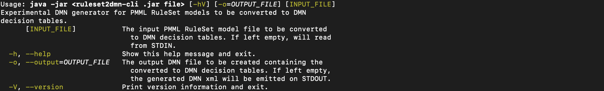

<!--
  Licensed to the Apache Software Foundation (ASF) under one
  or more contributor license agreements.  See the NOTICE file
  distributed with this work for additional information
  regarding copyright ownership.  The ASF licenses this file
  to you under the Apache License, Version 2.0 (the
  "License"); you may not use this file except in compliance
  with the License.  You may obtain a copy of the License at

    http://www.apache.org/licenses/LICENSE-2.0

  Unless required by applicable law or agreed to in writing,
  software distributed under the License is distributed on an
  "AS IS" BASIS, WITHOUT WARRANTIES OR CONDITIONS OF ANY
  KIND, either express or implied.  See the License for the
  specific language governing permissions and limitations
  under the License.
  -->

# Rule Induction to DMN utility

Experimental DMN generator for PMML RuleSet models to be converted to DMN decision tables

## How to use it

Please refer to the command line utility help available with the `--help` command line option:

```sh
java -jar kie-dmn-ruleset2dmn-cli-8.24.0-SNAPSHOT.jar --help
```

For example:



## Example usages:

```sh
java -jar kie-dmn-ruleset2dmn-cli/target/kie-dmn-ruleset2dmn-cli-8.24.0-SNAPSHOT.jar  kie-dmn-ruleset2dmn/src/test/resources/wifi.pmml 
java -jar kie-dmn-ruleset2dmn-cli/target/kie-dmn-ruleset2dmn-cli-8.24.0-SNAPSHOT.jar -o=wifi.dmn kie-dmn-ruleset2dmn/src/test/resources/wifi.pmml 
cat kie-dmn-ruleset2dmn/src/test/resources/wifi.pmml | java -jar kie-dmn-ruleset2dmn-cli/target/kie-dmn-ruleset2dmn-cli-8.24.0-SNAPSHOT.jar -o=wifi.dmn
cat kie-dmn-ruleset2dmn/src/test/resources/wifi.pmml | java -jar kie-dmn-ruleset2dmn-cli/target/kie-dmn-ruleset2dmn-cli-8.24.0-SNAPSHOT.jar 
```
