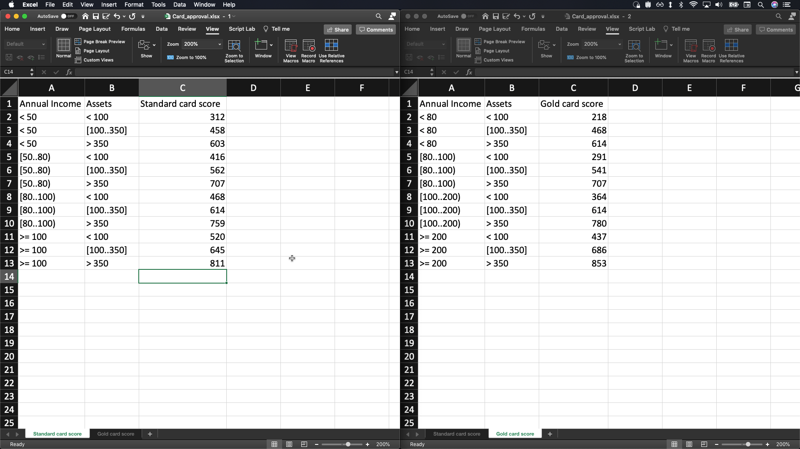

<!--
  Licensed to the Apache Software Foundation (ASF) under one
  or more contributor license agreements.  See the NOTICE file
  distributed with this work for additional information
  regarding copyright ownership.  The ASF licenses this file
  to you under the Apache License, Version 2.0 (the
  "License"); you may not use this file except in compliance
  with the License.  You may obtain a copy of the License at

    http://www.apache.org/licenses/LICENSE-2.0

  Unless required by applicable law or agreed to in writing,
  software distributed under the License is distributed on an
  "AS IS" BASIS, WITHOUT WARRANTIES OR CONDITIONS OF ANY
  KIND, either express or implied.  See the License for the
  specific language governing permissions and limitations
  under the License.
  -->

Experimental DMN generator for Excel (.xls/.xlsx) file containing DMN decision tables.

NOTE being an experimental feature, the behaviour, requirements and capabilities may vary at any time.

This can be an helpful utility to convert spreadsheet file into DMN decision table automatically.

# Downloading this CLI Utility from Maven Central repository

You can retrieve this CLI Utility from Maven Central by downloading it from: https://search.maven.org/artifact/org.kie/kie-dmn-xls2dmn-cli

You should download the file `kie-dmn-xls2dmn-cli-<version>.jar`, where `<version>` is the latest available or desired one.

Alternatively, you can retrieve the `.jar` file on the current local directory,
by running the following Maven command from the command line and replacing for the needed `<version>`:

```bash
mvn org.apache.maven.plugins:maven-dependency-plugin:3.2.0:copy -Dartifact=org.kie:kie-dmn-xls2dmn-cli:<version>:jar -DoutputDirectory=.
```

# CLI Usage

```
Usage: java -jar <xl2dmn .jar file> [-hV] INPUT_FILE [OUTPUT_FILE]
Experimental DMN generator for Excel (.xls/.xlsx) file containing DMN decision
tables.
      INPUT_FILE      The input Excel (.xls/.xlsx) file containing DMN decision
                        tables.
      [OUTPUT_FILE]   Specify filename for generated DMN model file.
                      If not specified, will generate INPUT_FILE with .dmn
                        postfixed.
  -h, --help          Show this help message and exit.
  -V, --version       Print version information and exit.
```

For example:

```bash
java -jar kie-dmn-xls2dmn-cli-7.57.0.Final.jar Loan_approvals.xlsx 
```

will generate a DMN model file named `Loan_approvals.xlsx.dmn`.

# Formalising Decision Table in the Spreadsheet file

Requirements:
- knowledge of the DMN Specification and DMN Methodologies
- knowledge of Excel Spreadsheet application

This converters transforms Excel (.xls/.xlsx) file automatically into DMN decision tables IF the content of the spreadsheet matches specific conventions.

The following conventions are assumed for the Spreadsheet file containing the Decision Table(s):

- each Sheet represents a Decision Table
- the rightmost column in the Sheet, represents be the output column of the Decision Table
  - the header for the rightmost column SHALL BE the same as the Sheet name
- column to the left of the rightmost column in the Sheet, represent dependent InputData(s) or sub-Decision(s)
  - if a dependent is present in its own Sheet, it is assumed it is a dependent sub-Decision
  - if a dependent is not defined in a Sheet, it is assumed it is a dependent InputData
- the content of the cell MUST BE the exact FEEL value or FEEL unary test expected, as the value is placed in the generated DMN model as-is
- each Sheet content MUST start at cell A1

## Example

For example, this Excel spreadsheet formalises a `Loan Approval` as a first DMN Decision Table:


in this decision table, accordingly to the conventions described above:

- `DTI Rating`, `PITI Rating` are dependent sub-Decision(s)
- `FICO Score` is a dependent InputData

The remaining Sheets are formalised as follows:


Accordingly, for the decision table `PITI Rating` there is one depdendent InputData named `PITI Ratio`; for the decision table `DTI Rating` there is one dependent InputData named `DTI Ratio`.

Running the CLI Utility will generate the following DMN model, as expected:


and with each Decisions containing the respective Decision Table:


# Example: ChineseLunarYears

This example is provded to show the convenience in using the CLI Utility converter, instead of having to define by hand all the values in any DMN Editor. The values have been fetched from online sources and the expected FEEL expression defined in the Spredsheet.


Once transformed it consist of a dependend InputData and one Decision, the single Sheet:


The Decision Table contains the expected values:


# Example: Card_approval

This example is provded to show the convenience in using the CLI Utility converter to define score values in the Spreadsheet, instead of having to be defined by hand in any DMN Editor. 



Once transformed it consist of a two InputData(s) and two Decision, as expected:


The Decision Table(s) contain the expected values:


