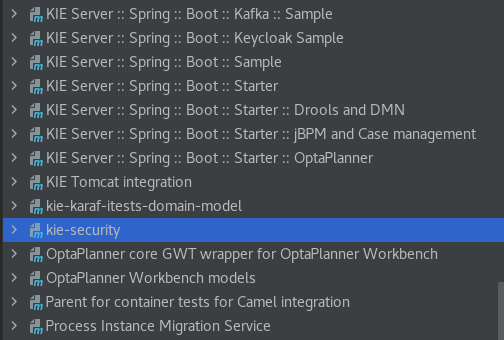
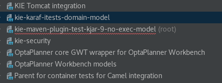

<!--
  Licensed to the Apache Software Foundation (ASF) under one
  or more contributor license agreements.  See the NOTICE file
  distributed with this work for additional information
  regarding copyright ownership.  The ASF licenses this file
  to you under the Apache License, Version 2.0 (the
  "License"); you may not use this file except in compliance
  with the License.  You may obtain a copy of the License at

    http://www.apache.org/licenses/LICENSE-2.0

  Unless required by applicable law or agreed to in writing,
  software distributed under the License is distributed on an
  "AS IS" BASIS, WITHOUT WARRANTIES OR CONDITIONS OF ANY
  KIND, either express or implied.  See the License for the
  specific language governing permissions and limitations
  under the License.
  -->
Kie-maven-plugin integration tests.
===================================

kie-maven-plugin integrations tests are tests that:
1) builds a kjar out of some resources, using the kie-maven-plugin
2) uses the generated kjar

They are written following the maven standard layout and they features the maven-invoker-plugin.
For each of those tests, there is a specific directory under _src/it_.
Poms and sources are filtered to have the current drools version during execution.
Surefire (unit) tests are excluded, while integration (failsafe) ones are executed. To allow that, test classes must be named with trailing "IT" (e.g. _BuildPMMLTrustyTestIT_).
If java tests classes needs to be filtered, they have to be put under _src/test/java-filtered_ directory (from here, they will be filtered and copied under _scr/test/java_ one).
Test compilations and reports may be found under _target/it/{module_name}_ directory.
_target/it/{module_name}/build.log_ will contain overall build output, while additionally test reports may be found under
_target/it/{module_name}/target/failsafe-reports_ and _target/it/{module_name}/target/surefire_

Skipping/selecting tests
========================
To completely disable execution of those tests, the standard approach is to set the _invoker.skip_ parameter to false:

    mvn clean install -Dinvoker.skip=true

A specific configuration has also been implemented to disable those tests with the _skiptITs_ parameter:

    mvn clean install -DskipITs

To run only certain of those tests, use the _invoker.test_ parameter with a pattern of the directory to be executed, e.g.:

    mvn clean install -Dinvoker.test=kie-maven-plugin-test-kjar-1*

    mvn clean install -Dinvoker.test=*-default

Common code and overall setup
=============================
All those tests share some common code, mostly related to the _KieContainer/KieBase/KieSession_ instantiation.
To avoid duplication and enforce consistency, a couple of shared modules have been created: 
1) kie-maven-plugin-test-kjar-parent
2) kie-maven-plugin-test-kjar-common

The former define common dependencies and build setup; all the tests declare this as parent and may override/extend it.
The latter contains the shared code, it is optional, and it is used by tests that actually require it.

To ensure that those twos are built and installed before the others, there are the following details

1) their _invoker.properties_ file declares the _clean install_ goals
2) they are nested under _kie-maven-plugin-test-kjar-setup_
3) inside kie-maven-plugin/pom.xml, the invoker configuration define _kie-maven-plugin-test-kjar-setup_ to be invoked before the others
   (see [here](https://maven.apache.org/plugins/maven-invoker-plugin/examples/prepare-build-env.html) for more details)

   `<artifactId>maven-invoker-plugin</artifactId>
   <configuration>
        <setupIncludes>
            <setupInclude>kie-maven-plugin-test-kjar-setup/pom.xml</setupInclude>
        </setupIncludes>
        <pomIncludes>
            <pomInclude>*/pom.xml</pomInclude>
        </pomIncludes>`

Ignored tests
=============

Tests using the _SerializeMojo_ have been removed because such mojo was used for Android, whose support has been dropped down.

KieContainer
============

Due to the order of execution of different steps, KieContainer for a given kjar can not be instantiated from local repository.
So, a workaround has been devised to create a KieContainer out of the kjar locally packaged (inside _target_ folder).

Here's an example on how to achieve that (_DeclaredTypesTestIT_ is the class this snippet has been taken from, _DeclaredTypeKBase_ is the kiebase name defined in the companion kmodule.xml):
 
        
        final URL targetLocation = DeclaredTypesTestIT.class.getProtectionDomain().getCodeSource().getLocation();
        final File basedir = new File(targetLocation.getFile().replace("/test-classes/", ""));
        final File kjarFile = new File(basedir, GAV_ARTIFACT_ID + "-" + GAV_VERSION + ".jar");
        Assertions.assertThat(kjarFile).exists();
        Set<URL> urls = new HashSet<>();
        urls.add(kjarFile.toURI().toURL());
        URLClassLoader projectClassLoader = URLClassLoader.newInstance(urls.toArray(new URL[0]), getClass().getClassLoader());

        final KieServices kieServices = KieServices.get();
        final KieContainer kieContainer =  kieServices.getKieClasspathContainer(projectClassLoader);

        KieSession kSession = null;
        try {
            final KieBase kieBase = kieContainer.getKieBase("DeclaredTypeKBase");
            kSession = kieBase.newKieSession();
        ....`

Write and debug tips
====================

To start with, a useful starting point would be to create, inside _it_ directory, vanilla maven module containing the definition of the kjar project to test, with defined version (i.e. without version' placeholder).
After that, look at other tests and at _org.kie.maven.plugin.ittests.public class ITTestsUtils_ to see what kind of tests have already been implemented.
If the scope of the integration test is only the successful packaging of the kjar, no test class is needed.
At that phase the compilation and test execution can be done invoking standard maven commands from the root of the integration test module. Debug from IDE is also possible.
Next step is to enable the integration test inside the invoker lifecycle; to do that 

1) add _invoker.properties_ file to the integration test
2) replace the static version with the placeholder
   
Then, issue 

    mvn clean install

from kie-maven-plugin directory.

There are different ways to debug the integration test after it is enabled as invoker module

1) inside _invoker.properties_ file, enable remote debugging with the line 
    
    invoker.mavenOpts=-Xdebug -Xnoagent -Xrunjdwp:transport=dt_socket,server=y,suspend=y,address=8000

2) launch maven build inside the _target/it/{module_name}_ 
3) add _target/it/{module_name}_ as maven project inside IDE; this will allow IDE debugging (see [below](#adding-_targetitmodule_name_-as-maven-project-inside-ide) for detailed instructions).

The last two methods may be useful to debug/fix code; be aware to delete the sources file inside _target/it/{module_name}/src/test/java-filtered_ before.
The fixed code/pom may then be copied back to the original integration test.

Adding _target/it/{module_name}_ as maven project inside IDE
------------------------------------------------------------
This method has been tested on _IntelliJ IDEA 2020.3.3 (Ultimate Edition)_, but should work on other versions and also inside different IDEs (with appropriate commands).

1) expand the left panel "Project"
2) right click on _target/it/{module_name}/pom.xml_
3) in the opened menu, click "Add as Maven Project"

The project should now appear on the right panel "Maven".

This a screenshot before adding a project:

And this after it has been successfully added.

To remove a project from Maven panel, right click on it and select "Unlink Maven Projects".