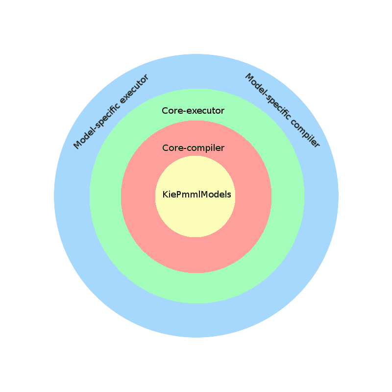
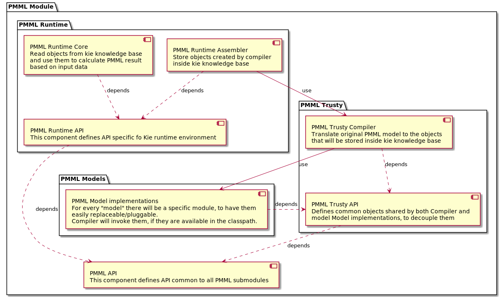
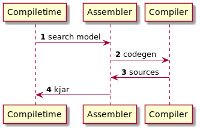
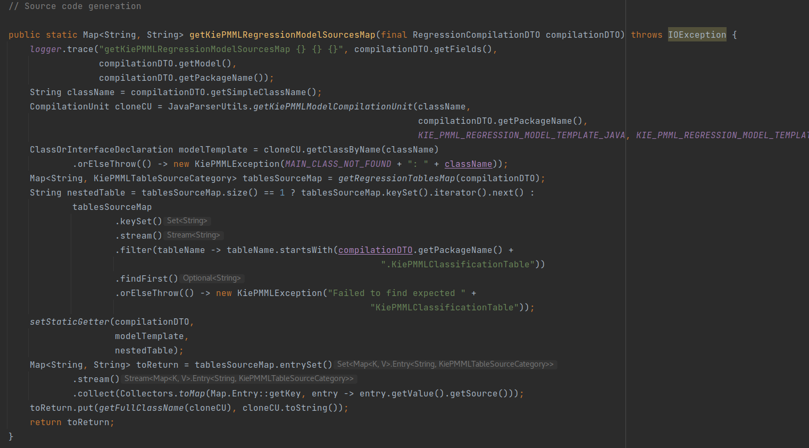
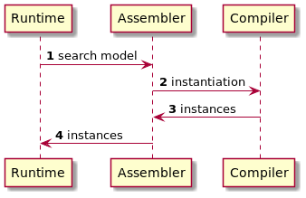
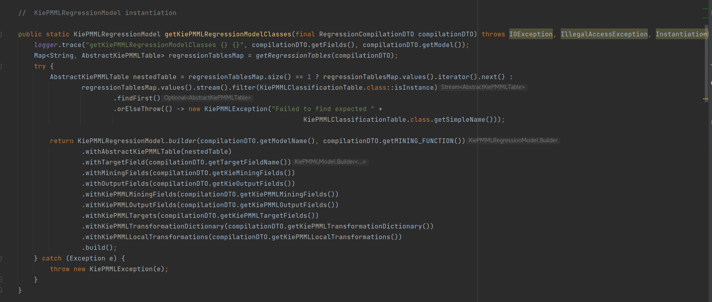

<!--
  Licensed to the Apache Software Foundation (ASF) under one
  or more contributor license agreements.  See the NOTICE file
  distributed with this work for additional information
  regarding copyright ownership.  The ASF licenses this file
  to you under the Apache License, Version 2.0 (the
  "License"); you may not use this file except in compliance
  with the License.  You may obtain a copy of the License at

    http://www.apache.org/licenses/LICENSE-2.0

  Unless required by applicable law or agreed to in writing,
  software distributed under the License is distributed on an
  "AS IS" BASIS, WITHOUT WARRANTIES OR CONDITIONS OF ANY
  KIND, either express or implied.  See the License for the
  specific language governing permissions and limitations
  under the License.
  -->

Design Overview
===============

Trusty PMML has been designed following the "Clean Architecture" principles

The following diagram shows the components, and their relationship, of Trusty PMML implementation:

Inside Trusty PMML there are two separated phases: compile-time and runtime: the former relates to translations of original PMML model, and the former to its execution.

All the behavior is defined in common classes extending `KiePMMPModel`. The compile-time defines how those classes are actually instantiated, while runtime uses such instances to provide actual results.

Compilation may follow two different code path: the code-generation one, used for kjar creation (Drools 7.x) and inside Kogito (Drools 8.x); and the "Interpreted" one, executed when a model is submitted/modified during execution of the container environment.

Code-generation compilation
---------------------------

The following diagram illustrate the code-generation path:

During the code-generation, a `Factory` class is generated, whose scope is to instantiate an object of the specific KiePMMLModel class.

This is an example of its implementation for `KiePMMLRegressionModel` (`KiePMMLRegressionModelFactory`)

Interpreted compilation
---------------------------

The Interpreted path is represented by the following diagram:

In this case, in the code-base there is some code functionally identical to the one created in the `Factory` class mentioned above.

This is an example of its implementation for `KiePMMLRegressionModel` (`KiePMMLRegressionModelFactory`)

