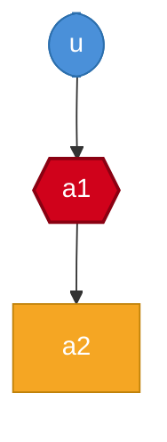

## Build Scope

**1 changed** (directly modified) · **2 affected** (changed + downstream, built + tested) · **1 upstream** (built, tests skipped)




<details>
<summary>Changed modules (1)</summary>

- `a1`

</details>

<details>
<summary>Upstream modules (1)</summary>

- `u`

</details>

<details>
<summary>Affected modules (2)</summary>

- `a1`
- `a2`

</details>

## Test Results

> ⚠️ **Some tests failed.**

| ✅ Passed | ❌ Failed | 💥 Errors | ⏭️ Skipped | TOTAL |
|---:|---:|---:|---:|---:|
| **2** | **1** | **0** | **0** | **3** |

### Failed Tests

<details>
<summary><b>a1</b> — 1 failure</summary>

**`com.example.A1Test#testFails`** — `java.lang.AssertionError`
> expected [true] but was [false]

</details>


## Reproduce This Build Locally

> Built on **ubuntu-latest** with **Java 21**

**Step 1 — Build upstream dependencies (tests skipped):**

```bash
mvn -T 1C --batch-mode --no-transfer-progress -fae -DskipTests -DskipITs -Denforcer.skip=true -Dcheckstyle.skip=true -Dformatter.skip=true -Darchunit.skip=true -Dsurefire.redirectTestOutputToFile=true -pl "g:u" install
```

**Step 2 — Build changed and affected modules (with tests):**

```bash
mvn --batch-mode --no-transfer-progress -fae -Dsurefire.redirectTestOutputToFile=true -pl "g:a1,g:a2" install
```

